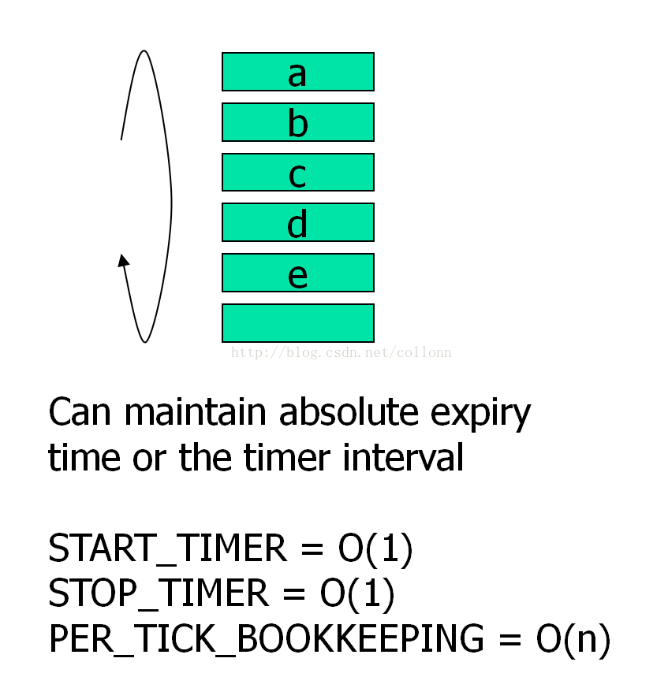
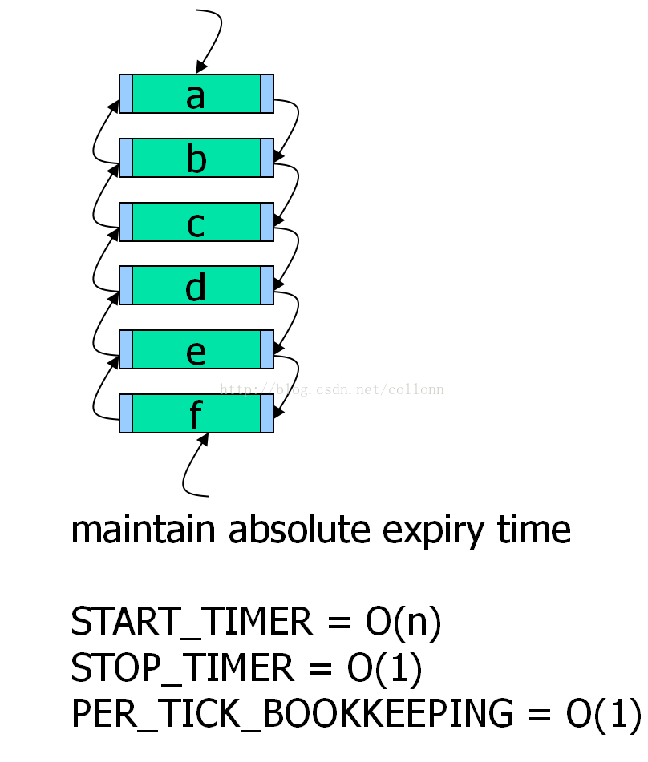
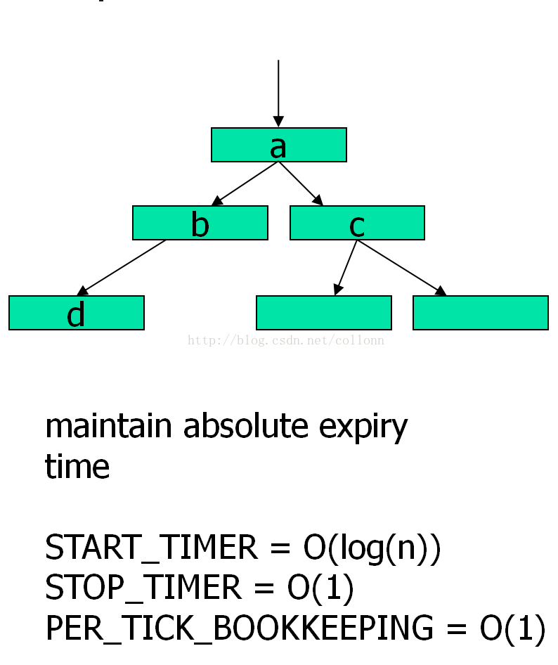
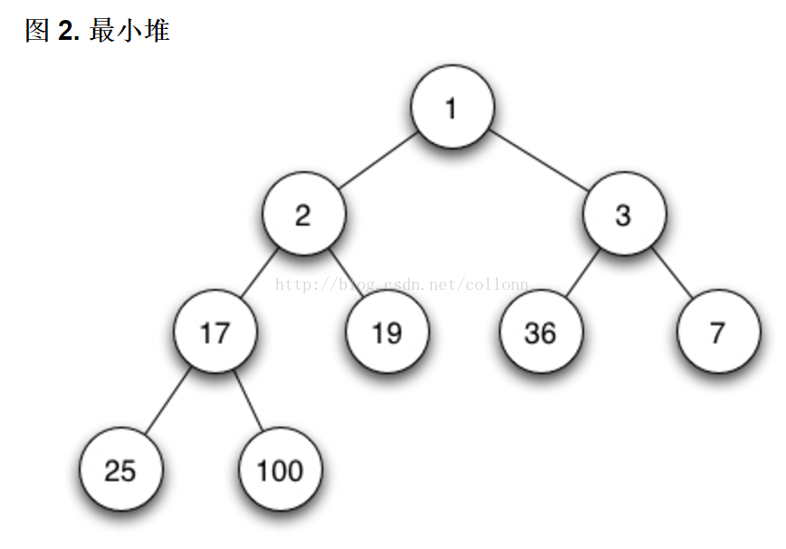
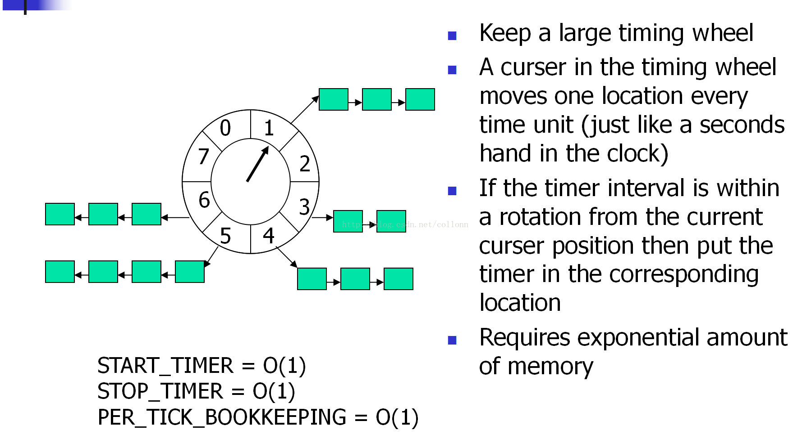
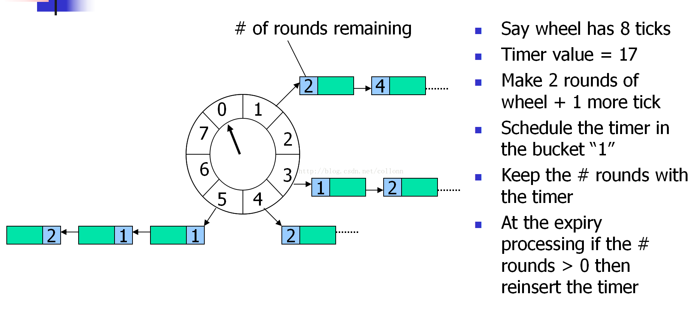
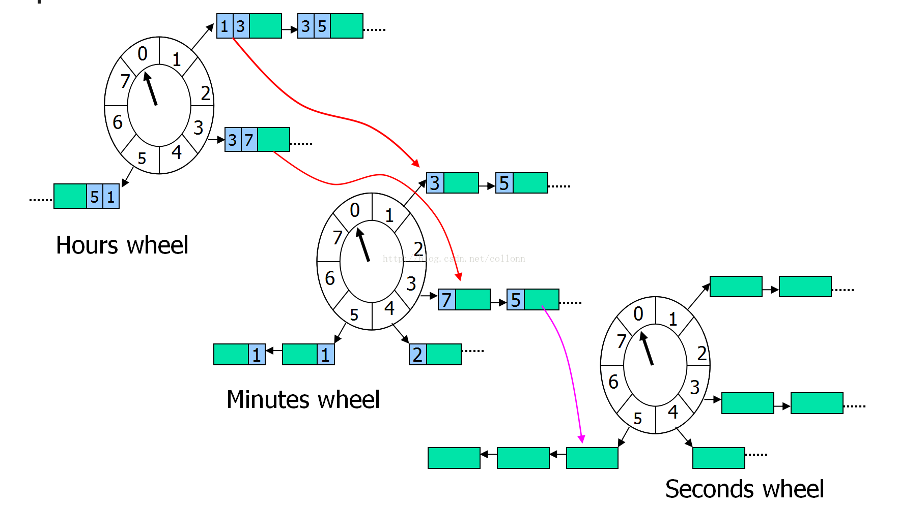
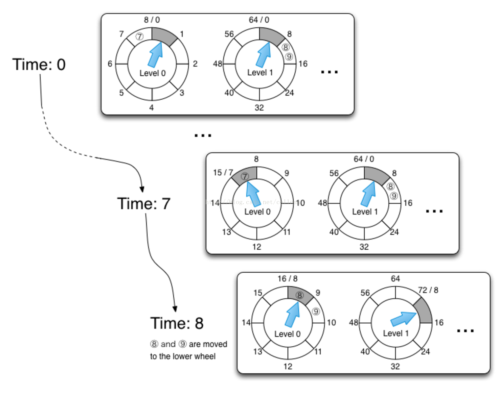
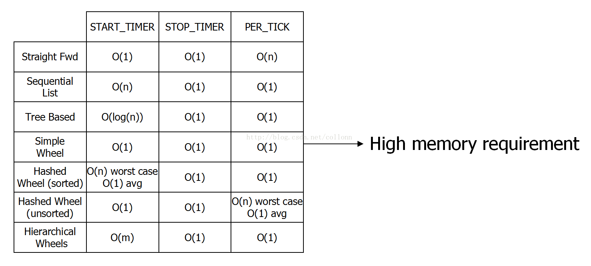

# 关于计时器定时器的设计 时间轮的高效实现 Linux Hashed Hierarchical Timing Wheel

## 基本定义
首先，给出一个基本定义，也是性能参考标准

定时器的实现，需要具备以下几个行为，这也是在后面评判各种定时器实现的一个基本模型 [1]：

`StartTimer(Interval, TimerId, ExpiryAction)`

注册一个时间间隔为 Interval 后执行 ExpiryAction 的定时器实例，其中，返回 TimerId 以区分在定时器系统中的其他定时器实例。时间复杂度取绝于数据结构。

`StopTimer(TimerId)`

根据 TimerId 找到注册的定时器实例并执行 Stop。时间复杂度为`O(1)`。

`PerTickBookkeeping()`

在一个 Tick 内，定时器系统需要执行的动作，它最主要的行为，就是检查定时器系统中，是否有定时器实例已经到期。时间复杂度取绝于数据结构。


## 基于无序链表的定时器

新的定时任务直接 insert to tail of list，但每经过一个 tick，都要 scan all item of list，方可找到逾期任务。




## 基于有序链表的定时器

添加新定时任务时，将任务根据定时时间插入到有序链表(小到大)中，这是一个重排序过程，所以也是要 scan all item of list。 但每经过一个 tick 时间，表头任务就是时间最早的任务，所以用`O(1)`的时间即可找到逾期任务。



## 基于红黑树的定时器

原理同基于有序链表的定时器，只是用红黑树来优化了 scan all item 的时间，搜索任务的时间复杂度是`O(lgN)`。



## 基于最小堆的定时器

原理同红黑树定时器，但比红黑树优化的是，只需要堆定保持最小即可，不用对 all item 进行有序化，较红黑树来说，减少了比较与交换的次数。



`java.util.Timer`和`java.util.concurrent.ScheduledThreadPoolExecutor`中的`DelayedWorkQueue`，都是基于Heap Array 的局部优先队列来设计的。

## 基于简单时间轮的定时器

性能最好，缺点是，如果(定时/计时)周期很长，内存耗费比较大。




Netty 之基于 Hashed 无序(有序)的时间轮定时器(比如`io.netty.util.HashedWheelTimer`)。假如定时器有 8 个 ticks，定时任务是第17个 ticks 时执行。

```
round=17/8=2
tick=17%8=1
```

所以将这个定时任务放在第1个 ticks，它的 round 值是2。指针每转到`tick=1`时，`round`减1，当`round=0`时，触发定时器任务。

可以看得出，如果所有的定时任务的 round 都等于0，性能是最好的，否则，在遍历任何一个tick的链表时，都会有只执行`round-1`，但不出发任务的操作。



## Linux 之基于层级结构的时间轮定时器

性能好且稳定(无论定时任务时间比较长还是比较短)，原在是有不同的时间指针，所以每经过一个 tick，总是立即获取到时间最近的任务列表。





各种定时器时间复杂度和内存复杂度比较


