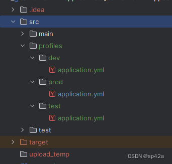
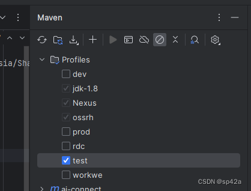

# 初始化一个项目


# 🔧 安装

## 系统要求

- Java 8 及以上，Spring 5.1 及以上，MySQL 8 及以上
- 前端基于 Vue2/iView，要求支持 ECMAScript 6+ 的浏览器
- 轻量级设计，对系统要求低，单核/512MB RAM 即可运行服务

---

## 下载与源码

包括依赖包在内的 JAR 包约 300 多 KB。

### Maven 依赖

[](https://search.maven.org/artifact/com.ajaxjs/ajaxjs-framework)

```xml
<!-- AJ 框架 -->
<dependency>
    <groupId>com.ajaxjs</groupId>
    <artifactId>ajaxjs-framework</artifactId>
    <version>1.1.8</version>
</dependency>
```

### 源码信息

源码采用 Apache License Version 2.0，可自由使用和修改。

- [GitHub 仓库](https://github.com/sp42/ajaxjs)
- [Gitee 镜像](https://gitee.com/sp42_admin/ajaxjs)


## 依赖与项目结构

你可以直接依赖 AJ 的 Maven（参见[《安装》](install.html)），不过更推荐通过父 `pom.xml` 依赖方式整合，包含 MySQL 驱动、Tomcat、Spring 等的依赖。  
如下是一个 `pom.xml` 的例子，使用了 `aj-common-parent` 的 `1.7` 版本。整个工程的结构跟普通的 Spring Boot 一样，都是 `main()` 函数启动。你需要在节点 `project.mainClass` 指定项目主类运行入口，也就是 `main()` 函数所在的类。

## aj-common-parent 当前最新版本

[](https://search.maven.org/artifact/com.ajaxjs/aj-common-parent)

### 示例 pom.xml

```xml
<project xmlns="http://maven.apache.org/POM/4.0.0"
    xmlns:xsi="http://www.w3.org/2001/XMLSchema-instance"
    xsi:schemaLocation="http://maven.apache.org/POM/4.0.0 https://maven.apache.org/xsd/maven-4.0.0.xsd">
    <modelVersion>4.0.0</modelVersion>
    <parent>
        <groupId>com.ajaxjs</groupId>
        <artifactId>aj-common-parent</artifactId>
        <version>1.7</version>
        <relativePath/>
    </parent>
    <artifactId>aj-iam-server</artifactId>
    <version>1.0</version>
    <description>AJ-IAM Server</description>
    <packaging>jar</packaging>

    <properties>
        <!-- 这里是项目主类运行入口 -->
        <project.mainClass>com.ajaxjs.iam.server.IamServerApp</project.mainClass>
    </properties>

    <dependencies>
        <!-- 加入你项目的依赖 -->
        <dependency>
            <groupId>org.springframework.data</groupId>
            <artifactId>spring-data-redis</artifactId>
            <version>2.6.10</version>
        </dependency>
    </dependencies>
</project>
```

# 配置

在资源目录中安排 `application.yml` 文件，内容如下：

```yaml
server:
    port: 8888 # 端口号
    context-path: /iam  # 项目名，如果不设定，默认是 /
    localFileUpload: false # 是否支持本地文件上传
```

代码结构按照惯常开发的模式即可。必须要有启动类和相关的配置类。


`main()` 函数内的 `start()` 必须传入配置类参数；指定 `@ComponentScan` 扫描包的范围。

### 启动类示例

```java
import com.ajaxjs.embeded_tomcat.EmbeddedTomcatStarter;
import com.ajaxjs.framework.BaseWebMvcConfigure;
import org.springframework.context.annotation.ComponentScan;
import org.springframework.context.annotation.Configuration;
import org.springframework.web.servlet.config.annotation.EnableWebMvc;

@Configuration
@EnableWebMvc
@ComponentScan({"com.foo"})
public class FooApplication extends BaseWebMvcConfigure {
    public static void main(String[] args) {
        EmbeddedTomcatStarter.start(FooApplication.class); // FooApplication 本身为配置类
    }
}
```

### BaseApplication 配置类示例

```java
import com.ajaxjs.data.jdbc_helper.JdbcConn;
import com.ajaxjs.data.jdbc_helper.JdbcWriter;
import com.ajaxjs.iam.resource_server.UserInterceptor;
import com.ajaxjs.util.logger.LogHelper;
import org.springframework.beans.factory.annotation.Value;
import org.springframework.beans.factory.config.ConfigurableBeanFactory;
import org.springframework.context.annotation.Bean;
import org.springframework.context.annotation.Configuration;
import org.springframework.context.annotation.Scope;
import org.springframework.util.StringUtils;
import org.springframework.web.servlet.config.annotation.CorsRegistry;
import org.springframework.web.servlet.config.annotation.InterceptorRegistration;
import org.springframework.web.servlet.config.annotation.InterceptorRegistry;
import org.springframework.web.servlet.config.annotation.WebMvcConfigurer;

import javax.sql.DataSource;

/**
 * 程序配置
 */
@Configuration
public class FooConfig implements WebMvcConfigurer {
    @Value("${db.url}")
    private String url;

    @Value("${db.user}")
    private String user;

    @Value("${db.psw}")
    private String psw;

    @Bean(value = "dataSource", destroyMethod = "close")
    DataSource getDs() {
        return JdbcConn.setupJdbcPool("com.mysql.cj.jdbc.Driver", url, user, psw);
    }
}
```

## 非配置文件启动

如果你不采用 `application.yml` 配置文件，那么使用 Java 配置亦可。

```java
public static void main(String[] args) {
    TomcatConfig cfg = new TomcatConfig();
    cfg.setEnableJsp(true);
    cfg.setPort(8080);
    cfg.setContextPath("/bar");

    new EmbeddedTomcatStarter(cfg, new Class[]{FooApplication.class}).start();
}
```

# Profiles

在实际使用环境中，我们同一个应用可能需要在不同环境运行（开发、测试、生产等），每个环境的参数都有可能不同（连接参数、日志级别等），使用 profiles 可以将不同环境下的参数进行拆分，并指定加载。

## IDEA 配置方式

在 `src` 目录下创建 `profiles` 目录，安排如下图的配置文件。



要选择哪个 profile，在 IDEA 里面选 Maven Profile 打勾即可。



 